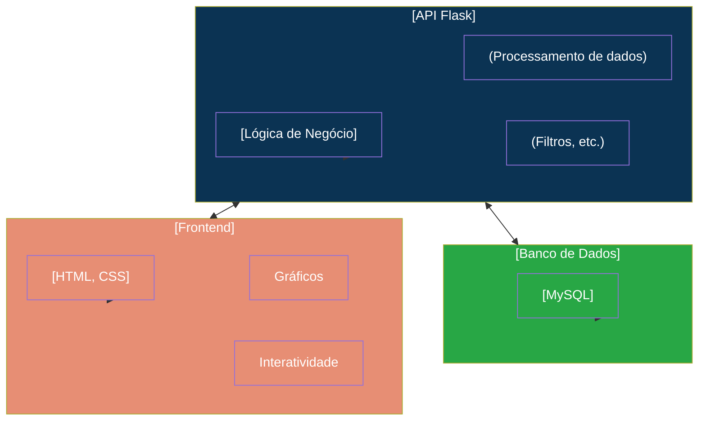
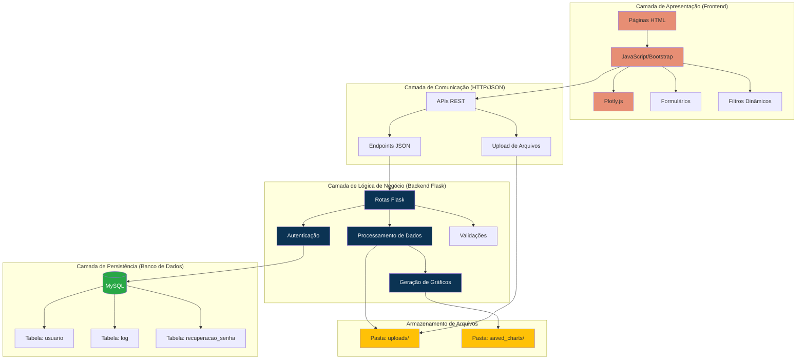
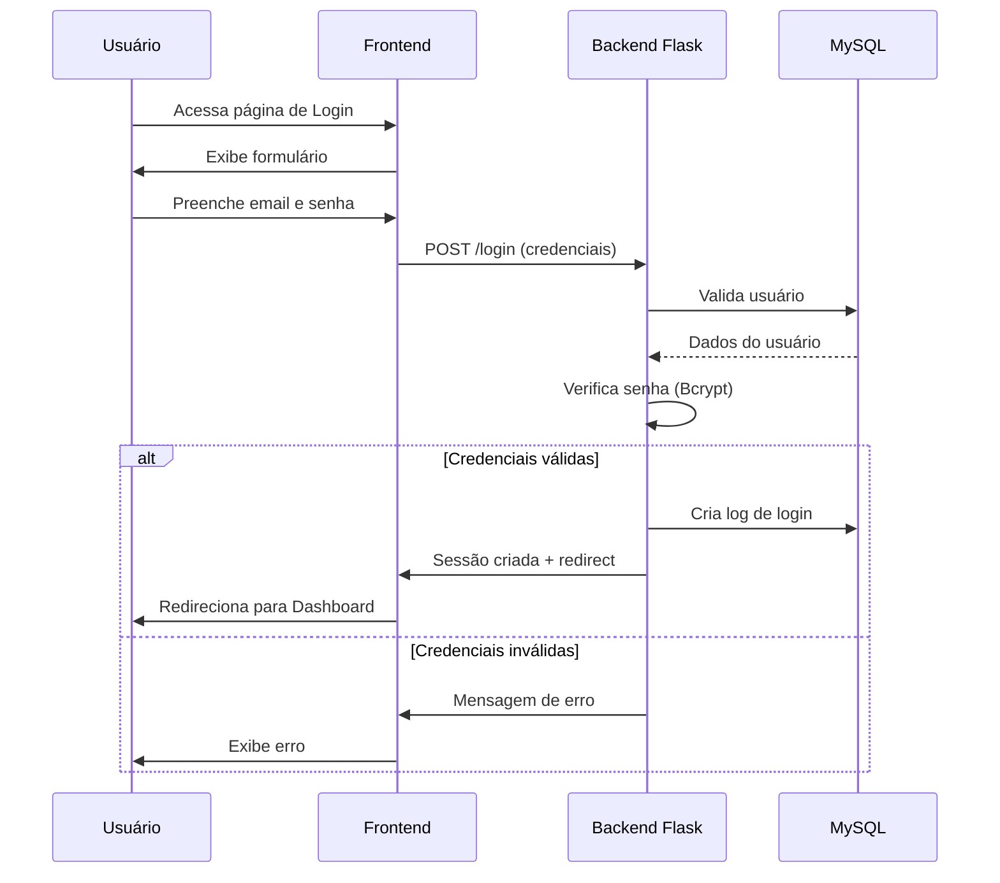
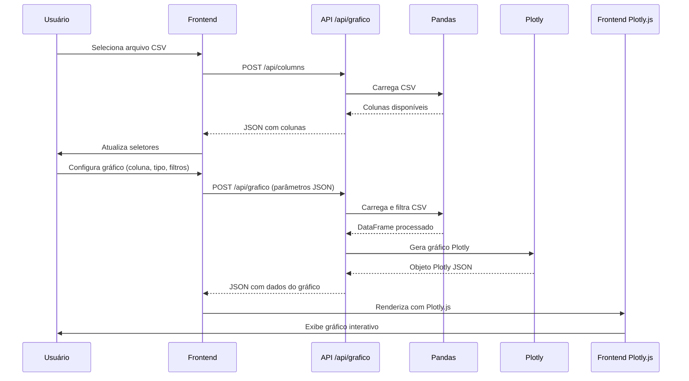
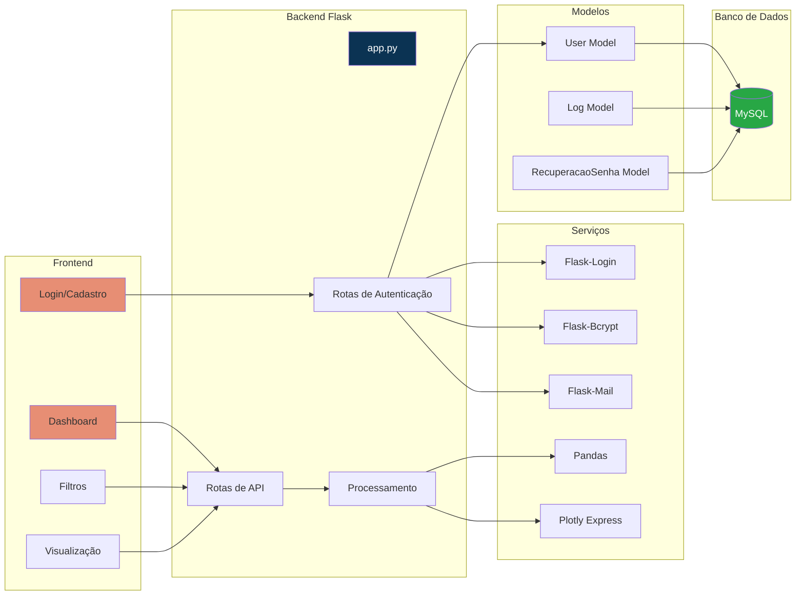
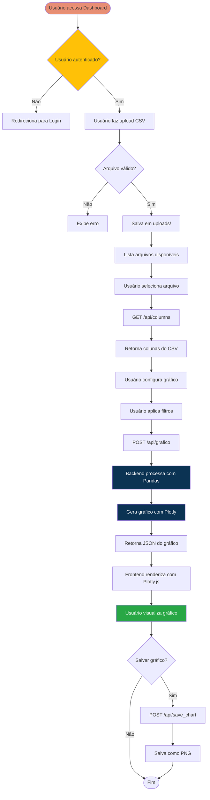
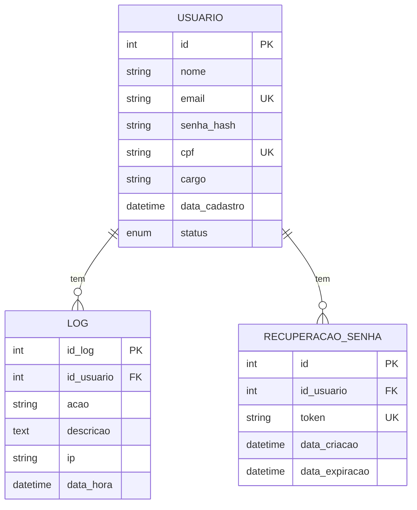
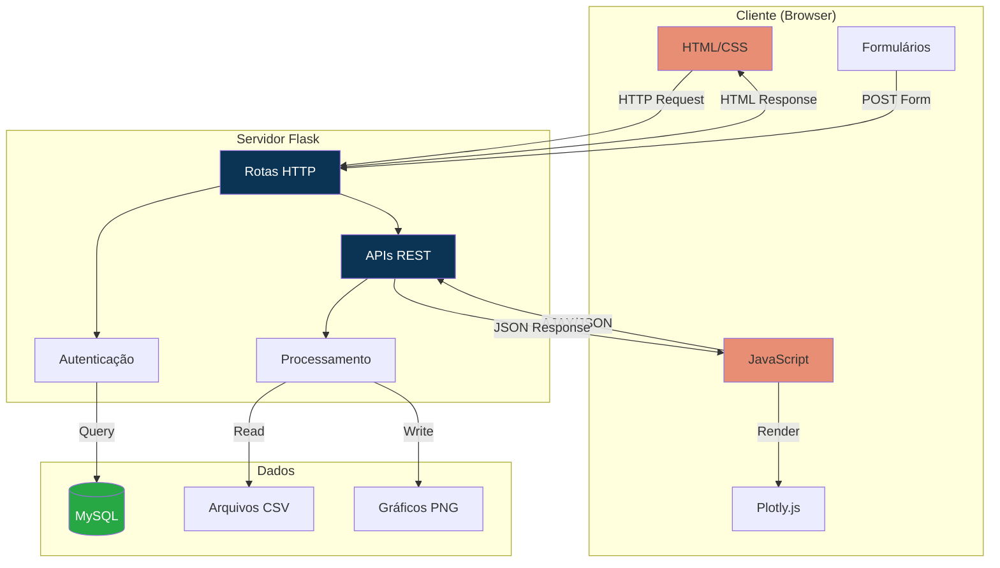

# Diagrama Simplificado do Sistema SPA

## 5.6 Diagrama Simplificado

## Diagrama de Arquitetura em Camadas

## Fluxo de Autenticação

## Fluxo de Geração de Gráficos

## Diagrama de Componentes do Sistema

## Fluxo de Upload e Análise de CSV

## Estrutura de Dados - Modelo Entidade-Relacionamento Simplificado

## Arquitetura de Comunicação Cliente-Servidor

## Legenda

- **Laranja (#E78E74)**: Componentes Frontend
- **Azul Escuro (#0B3353)**: Componentes Backend
- **Verde (#28a745)**: Banco de Dados
- **Amarelo (#ffc107)**: Armazenamento de Arquivos

---

## Notas sobre o Diagrama

1. **Camada de Apresentação**: Responsável pela interface do usuário e interações visuais
2. **Camada de Comunicação**: Gerencia a troca de dados via HTTP/JSON entre frontend e backend
3. **Camada de Lógica de Negócio**: Processa requisições, valida dados e gera gráficos
4. **Camada de Persistência**: Armazena dados de usuários, logs e tokens
5. **Armazenamento de Arquivos**: Gerencia arquivos CSV e gráficos salvos

O sistema segue uma arquitetura em camadas (layered architecture) que separa responsabilidades e facilita manutenção e escalabilidade.

